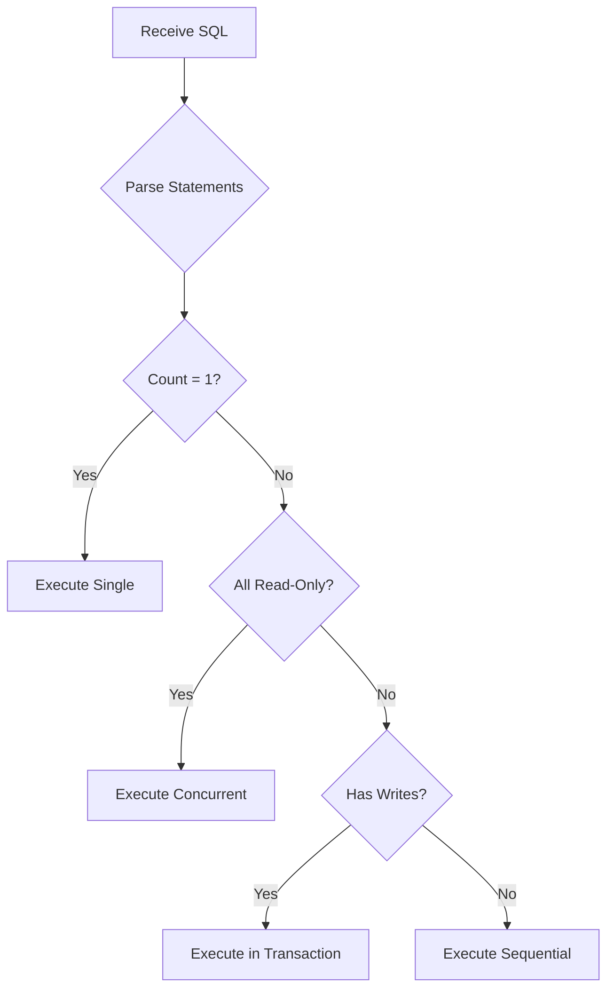

## Overview

Executes SQL queries against PostgreSQL databases with intelligent handling of single and multi-statement queries. Supports automatic transaction wrapping, concurrent execution of read-only queries, and query optimization.

## Request

<ParamField body="host" type="string" required>
  PostgreSQL server hostname or IP address
</ParamField>

<ParamField body="port" type="number" required>
  PostgreSQL server port number
</ParamField>

<ParamField body="user" type="string" required>
  PostgreSQL username for authentication
</ParamField>

<ParamField body="password" type="string">
  PostgreSQL user password
</ParamField>

<ParamField body="database" type="string" required>
  Target database name
</ParamField>

<ParamField body="sql" type="string" required>
  SQL query or queries to execute. Can contain:
  - Single SQL statement
  - Multiple semicolon-separated statements
  - Mixed SELECT and DML statements
</ParamField>

<ParamField body="sslMode" type="string">
  SSL connection mode (`disable`, `require`, `prefer`)
</ParamField>

## Response

### Single Statement Response

<ResponseField name="rows" type="array">
  Array of result rows for SELECT queries
</ResponseField>

<ResponseField name="fields" type="array">
  Column metadata for result set
</ResponseField>

<ResponseField name="rowCount" type="number">
  Number of rows affected/returned
</ResponseField>

<ResponseField name="command" type="string">
  SQL command type (SELECT, INSERT, UPDATE, DELETE, etc.)
</ResponseField>

<ResponseField name="executionTime" type="number">
  Query execution time in milliseconds
</ResponseField>

<ResponseField name="statement" type="string">
  The executed SQL statement
</ResponseField>

<ResponseField name="error" type="string">
  Error message if query failed
</ResponseField>

### Multiple Statements Response

<ResponseField name="multipleResults" type="boolean">
  Always `true` for multi-statement queries
</ResponseField>

<ResponseField name="results" type="array">
  Array of QueryExecutionResult objects, one per statement
</ResponseField>

<ResponseField name="totalExecutionTime" type="number">
  Total execution time for all statements in milliseconds
</ResponseField>

<ResponseField name="transactionUsed" type="boolean">
  Whether statements were wrapped in a transaction
</ResponseField>

<ResponseField name="error" type="string">
  Error message if any statement failed
</ResponseField>

## Query Execution Modes

### Single Statement

Executes directly against the connection pool:

```sql
SELECT * FROM users WHERE id = 1;
```

### Concurrent Execution

All read-only SELECT queries execute in parallel:

```sql
SELECT COUNT(*) FROM users;
SELECT COUNT(*) FROM orders;
SELECT COUNT(*) FROM products;
```

### Transaction Mode

Write operations (INSERT, UPDATE, DELETE) are wrapped in a transaction:

```sql
INSERT INTO users (name, email) VALUES ('John', 'john@example.com');
UPDATE users SET active = true WHERE name = 'John';
```

### Sequential Execution

Mixed read/write queries execute sequentially:

```sql
SELECT * FROM users WHERE id = 1;
UPDATE users SET last_login = NOW() WHERE id = 1;
```

## Examples

### Single SELECT Query

<RequestExample>
```bash cURL
curl -X POST http://localhost:3000/api/query \
  -H "Content-Type: application/json" \
  -d '{
    "host": "localhost",
    "port": 5432,
    "user": "postgres",
    "password": "mypassword",
    "database": "mydb",
    "sql": "SELECT id, name, email FROM users LIMIT 10;",
    "sslMode": "disable"
  }'
```
</RequestExample>

<ResponseExample>
```json Success (200)
{
  "rows": [
    { "id": 1, "name": "Alice", "email": "alice@example.com" },
    { "id": 2, "name": "Bob", "email": "bob@example.com" }
  ],
  "fields": [
    { "name": "id", "dataTypeID": 23 },
    { "name": "name", "dataTypeID": 1043 },
    { "name": "email", "dataTypeID": 1043 }
  ],
  "rowCount": 2,
  "command": "SELECT",
  "executionTime": 12,
  "statement": "SELECT id, name, email FROM users LIMIT 10;"
}
```
</ResponseExample>

### Multiple SELECT Queries (Concurrent)

<RequestExample>
```bash cURL
curl -X POST http://localhost:3000/api/query \
  -H "Content-Type: application/json" \
  -d '{
    "host": "localhost",
    "port": 5432,
    "user": "postgres",
    "password": "mypassword",
    "database": "mydb",
    "sql": "SELECT COUNT(*) FROM users; SELECT COUNT(*) FROM orders;"
  }'
```
</RequestExample>

<ResponseExample>
```json Success (200)
{
  "multipleResults": true,
  "results": [
    {
      "rows": [{ "count": "150" }],
      "fields": [{ "name": "count", "dataTypeID": 20 }],
      "rowCount": 1,
      "command": "SELECT",
      "executionTime": 8,
      "statement": "SELECT COUNT(*) FROM users;"
    },
    {
      "rows": [{ "count": "450" }],
      "fields": [{ "name": "count", "dataTypeID": 20 }],
      "rowCount": 1,
      "command": "SELECT",
      "executionTime": 6,
      "statement": "SELECT COUNT(*) FROM orders;"
    }
  ],
  "totalExecutionTime": 9
}
```
</ResponseExample>

### Transaction with Multiple Writes

<RequestExample>
```bash cURL
curl -X POST http://localhost:3000/api/query \
  -H "Content-Type: application/json" \
  -d '{
    "host": "localhost",
    "port": 5432,
    "user": "postgres",
    "password": "mypassword",
    "database": "mydb",
    "sql": "INSERT INTO users (name) VALUES ('\''Alice'\''); UPDATE users SET active = true WHERE name = '\''Alice'\'';"
  }'
```
</RequestExample>

<ResponseExample>
```json Success (200)
{
  "multipleResults": true,
  "transactionUsed": true,
  "results": [
    {
      "rows": [],
      "rowCount": 1,
      "command": "INSERT",
      "executionTime": 4,
      "statement": "INSERT INTO users (name) VALUES ('Alice');"
    },
    {
      "rows": [],
      "rowCount": 1,
      "command": "UPDATE",
      "executionTime": 3,
      "statement": "UPDATE users SET active = true WHERE name = 'Alice';"
    }
  ],
  "totalExecutionTime": 15
}
```
</ResponseExample>

### Query Error

<ResponseExample>
```json Error (500)
{
  "error": {
    "message": "relation \"nonexistent_table\" does not exist",
    "code": "42P01",
    "severity": "ERROR",
    "routine": "parserOpenTable",
    "executionTime": 5
  }
}
```
</ResponseExample>

### Transaction Rollback

<ResponseExample>
```json Error (500)
{
  "error": "Transaction failed at statement: UPDATE users SET invalid_column = 'value'... Error: column \"invalid_column\" does not exist"
}
```
</ResponseExample>

### Missing Required Fields

<ResponseExample>
```json Error (400)
{
  "error": "Missing required fields"
}
```
</ResponseExample>

### No Valid SQL

<ResponseExample>
```json Error (400)
{
  "error": "No valid SQL statements found"
}
```
</ResponseExample>

## Query Optimization

The query parser applies automatic optimizations:

1. **Whitespace Normalization**: Removes excess whitespace
2. **Comment Removal**: Strips SQL comments
3. **Statement Analysis**: Determines if queries are read-only
4. **Execution Strategy**: Selects optimal execution mode

From `/app/api/query/route.ts:34-40`:

```typescript
// Parse the query into individual statements
const statements = QueryParser.parseQuery(sql)

if (statements.length === 0) {
  return NextResponse.json({ error: 'No valid SQL statements found' }, { status: 400 })
}
```

## Execution Flow



## TypeScript Interface

From `/app/api/query/route.ts:5-13`:

```typescript
interface QueryExecutionResult {
  rows?: any[]
  fields?: any[]
  rowCount?: number
  command?: string
  executionTime: number
  statement: string
  error?: string
}
```

## Error Handling

### Statement-Level Errors

Each statement in a multi-statement query includes an `error` field if it fails:

```json
{
  "multipleResults": true,
  "results": [
    { "rows": [...], "executionTime": 10 },
    { "error": "syntax error at or near 'FRON'", "executionTime": 2 }
  ],
  "error": "One or more statements failed"
}
```

### Transaction Rollback

If any statement fails in a transaction, all changes are rolled back:

```typescript
try {
  await client.query('BEGIN')
  // Execute statements...
  await client.query('COMMIT')
} catch (error) {
  await client.query('ROLLBACK')
  throw error
}
```

## Performance Considerations

- **Connection Pooling**: Reuses connections across requests
- **Concurrent Reads**: Parallel execution for multiple SELECT queries
- **Query Optimization**: Automatic query rewriting for performance
- **Transaction Batching**: Groups writes to minimize round trips

<Note>
  Long-running queries may timeout based on PostgreSQL server settings. Consider using `statement_timeout` for query limits.
</Note>
